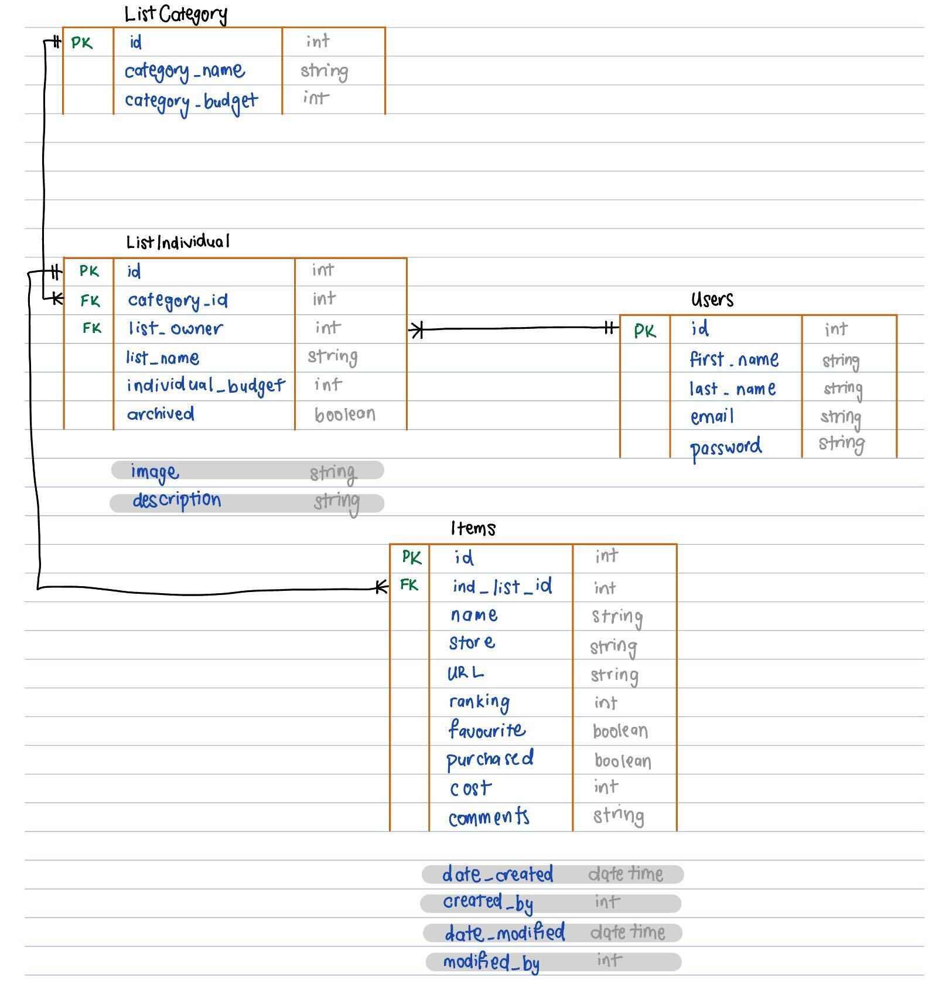

# The Good List - Christmas Shopping List
> Debugging Ducks

## Table of Contents

- [The Good List - Christmas Shopping List](#the-good-list---christmas-shopping-list)
  - [Table of Contents](#table-of-contents)
  - [Mission Statement](#mission-statement)
  - [Features](#features)
    - [Summary](#summary)
    - [Users](#users)
    - [List Categories](#list-categories)
    - [List Individual](#list-individual)
    - [Items](#items)
    - [Budget](#budget)
    - [Pages/endpoint functionality](#pagesendpoint-functionality)
    - [Nice To Haves](#nice-to-haves)
  - [Technical Implementation](#technical-implementation)
    - [Back-End](#back-end)
    - [Front-End](#front-end)
    - [Git \& Deployment](#git--deployment)
  - [Target Audience](#target-audience)
  - [Back-end Implementation](#back-end-implementation)
    - [API Specification](#api-specification)
    - [API Specification Object Definitions](#api-specification-object-definitions)
      - [CustomUser](#customuser)
      - [ListCategory](#listcategory)
      - [ListIndividual](#listindividual)
      - [Items](#items-1)
    - [Database Schema](#database-schema)
  - [Front-end Implementation](#front-end-implementation)

## Mission Statement

The Christmas Shopping List project is designed to simplify the holiday season by providing users with a seamless, stress-free way to organise their Christmas gift planning. Our mission is to create an intuitive and mobile-friendly platform that allows individuals, families, and groups to efficiently manage wish lists and shopping lists. By incorporating features such as group categorisation, budget tracking, ranking preferences, picking favourites, and marking items as purchased, we aim to transform the often chaotic task of holiday shopping into an enjoyable and collaborative experience.

We are committed to delivering a stylish, user-friendly interface that reflects the festive spirit, blending functionality with an elegant Christmas aesthetic. Through responsive design and robust backend technology, the platform will cater to users’ diverse needs while ensuring data security and accessibility.

## Features

To meet the tight timelines for delivery, we proposed structuring the development into two focused phases:

**Phase 1: Core MVP Features**

This phase will focus on delivering the essential functionalities that form the backbone of the Christmas Shopping List platform. These features will enable the client and users to begin testing and using the platform effectively and providing feedback. By prioritising the absolute minimum viable features, we can ensure timely delivery while maintaining high standards of quality and usability.

**Phase 2: Enhanced Functionality**

Once the core features are live, we will proceed to introduce additional functionalities that expand the platform’s capabilities. These features will be informed by client priorities and user feedback gathered during Phase 1 testing.

**Phase 3: Nice-to-have additional functionality**
We understand the importance of delivering a comprehensive product; however, given the project timeline, it is unlikely we will have sufficient time to incorporate the “nice-to-have” features. 

To maximise the value delivered within Phase 1, our client identified the top three features that are most critical to the platform’s success. This allowed us to focus development efforts on what matters most to the client and users.

Collaboration in this prioritisation ensured delivery of a high-impact product, with the flexibility to build on it further in subsequent phases. 

__The first three of the below features have been agreed upon for the MVP:__
1. Logged in users can create an individual shopping list in a category (e.g., family, friends) or their own wishlist and manually add/edit/remove items on the list.
2. Rank items on an individual shopping list or wishlist and mark items as favourite options or purchased.
3. Add a budget limit to a category or an individual list and compare estimated and actual costs.
4. Create user groups and share lists with other people for collaboration.
5. Pledging for joint presents.
6. Search catalog of shopping sites for ideas to add to the shopping or wish list. 
7. Secret Santa

### Summary 
Allow users to create secure accounts to create and manage Christmas wish lists and shopping lists. Logged in users will be able to **create wish lists and shopping lists** and will be able to add and remove items. Items can be **marked as purchased**.

__Enhanced functionality may include:__
- Items can be ranked and highlighted favourite.
- Ability to create groups and share lists with group members to collaborate.
- Ability to set budget limits per group or individual and compare actual costs.
- Responsiveness across different screen sizes (priority is mobile first, tablet and desktop sizes fall under enhanced functionality.)
- Ability to search for example Amazon via the shopping list platform (APIs that allow access to product databases) to add items to the wish/shopping list. 
- Ability to search more than one site (e.g. Amazon, Ebay, wish, etc.) requires an additional layer of formatting to append results to lists.
- To test search functionality, a site such as https://fakestoreapi.com/ could be used.

__Nice to have may include:__
Users will be able to use a Secret Santa generator, with the ability to set target values.

### Users

| Type              | Access                                                                                                                                                   | Role Type Assignment                                        |
|------------------|----------------------------------------------------------------------------------------------------------------------------------------------------------|-------------------------------------------------------------|
| **Superuser or Admin** | - All User access plus    - Create and manage lists    - Create and manage categories    - Create and manage other users | **Debugging Ducks**                                          |
| **User**        | - Can create account    - Can log in    - Can log out    - Create, edit, delete and archive lists    - Create, edit, delete and archive categories    - Manually add items to lists    - Rank items in lists    - Tick items off as purchased    - Set a budget for a category and/or an individual list    - View budget vs. actual costs    - Create user groups and invite other users to the group    - Share lists with group members    - Can search items    - Add items from searches to lists | **Users who sign up to use the app**                         |
| **Group Members** | - View lists that have been shared    - Edit lists that have been shared                                                                              | **Signed up users who have been invited to join a group**   |
| **Guest**        | - View Home Page    - View shared list via secure link that has been shared by a logged-in user                                                       | **Public: Users who haven’t signed up**                     |

### List Categories

| Feature                    | Access                  | Notes/Conditions                                                   |
|----------------------------|------------------------|-------------------------------------------------------------------|
| **Create categories**      | Users, Superuser/Admin | Categories can be customised (Family, friends, cousin brothers). |
| **Edit categories**        | Users, Superuser/Admin | Only the creator or admins can edit categories.                  |
| **Delete categories**      | Users, Superuser/Admin | Deletion prompts confirmation to avoid accidental removal.       |
| **View categories**        | Users, Group Members   | Group members can view categories in shared lists.               |
| **Assign categories to list items** | Users, Group Members | Categories can be applied to organise items.                     |

### List Individual

| Feature                      | Access                              | Notes/Conditions                                                                 |
|------------------------------|------------------------------------|---------------------------------------------------------------------------------|
| **Create a list**            | Users, Superuser/Admin            | Lists are private by default unless shared.                                     |
| **Edit a list**              | Users, Superuser/Admin            | Only the list creator or group members with edit permissions can modify a list. |
| **Delete a list**            | Users, Superuser/Admin            | Confirmation required to delete lists. Group members cannot delete shared lists. |
| **Archive a list**           | Users, Superuser/Admin            | Users can archive a list if that Christmas has passed but they still want to keep the list for reference. |
| **View lists**               | Users, Group Members, Guest (via link) | Guests can view lists shared via secure links.                                  |
| **Share a list**             | Users                              | Lists can be shared with group members or via a secure link for guests.         |
| **Add collaborators to a list** | Users                          | Requires users to be signed up and invited to the group.                        |
| **Filter lists**             | Users                              | Filter by categories, budget, etc.                                              |

### Items

| Feature                      | Access                              | Notes/Conditions                                                  |
|------------------------------|------------------------------------|------------------------------------------------------------------|
| **Add items manually**       | Users                              | Items can include name, category, store, price, URL, and notes.  |
| **Add items from a search**  | Users                              | Requires database integration (e.g., Amazon API).                |
| **Edit items**               | Users, Group Members               | Group members can edit items in shared lists.                    |
| **Delete items**             | Users, Group Members               | Confirmation required to delete items to avoid accidental removal. |
| **Rank items**               | Users, Group Members               | Items can be ranked by priority within a list.                   |
| **Mark items as purchased**  | Users, Group Members               | Changes are reflected in shared lists immediately.               |
| **View items**               | Users, Group Members, Guest (via link) | Guests can only view items in shared lists.                    |
| **Group items by category or store** | Users                      | Enables easier navigation and shopping.                          |

### Budget

| Feature                        | Access  | Notes/Conditions                                                                                           |
|--------------------------------|---------|----------------------------------------------------------------------------------------------------------|
| **Set a budget for a list**    | Users   | Budgets can be set for entire categories or individual lists.                                             |
| **View budget vs. actual costs** | Users | Automatically calculates based on item prices, favourite status (for estimates), and purchased status (for actuals). |
| **Edit budget**                | Users   | Only the list creator or group members with edit permissions can modify the budget.                       |
| **Track spending**             | Users   | Updates actual spending as items are marked as purchased.                                                 |
| **Alert for budget overruns**  | Users   | Visual cues or notifications when spending exceeds the set budget.                                        |

### Pages/endpoint functionality

| Page                 | Functionality                                                                                              | Comments                                                        |
|----------------------|----------------------------------------------------------------------------------------------------------|----------------------------------------------------------------|
| **Home Page**        | - Shows an overview of the features available on the website    - If user is logged in, the home page defaults to the List Landing Page | Maybe include a link to a sample list which is viewable even if you’re not logged in? |
| **Sign Up Page**     | - Sign-up form for people to create a new account                                                         |                                                                |
| **Login Page**       | - Login form for people to log in using their email & password                                           |                                                                |
| **List Landing Page** | - Shows all the categories and lists the user has    - Can create/edit/delete categories    - Links to All Lists Page, Category List Page, Individual List Page & My Wishlist Page | For logged-in users                                             |
| **All Lists Page**   | - Shows all the items on all the user’s lists in one page    - Can add/edit/delete items    - Filterable by person/list name, store, ranking, favourite, etc. | For logged-in users                                             |
| **Category List Page** | - Shows all items for all the lists in one category (e.g., Family)    - Can add/edit/delete items   | For logged-in users                                             |
| **Individual List Page** | - Shows all items in one individual list (e.g., Mum)    - Can add/edit/delete items    - Can archive the list | For logged-in users                                             |
| **My Wishlist Page** | - Shows all items in the user’s own wishlist    - Can add/edit/delete items                            | For logged-in users                                             |

### Nice To Haves

- **Wishlist Sharing and Shopping List Collaboration:** Users will be able to share wishlists and collaborate on shopping lists through shared user groups.
  - Collaborative Editing/Viewing: Shared lists can be collaboratively edited or viewed in real time.
  - Sharing Feature Availability Users can generate a shareable link for their wish list. The generated link is unique to each wish list and does not expose personal or sensitive data.
  - Access Permissions Only users with the shareable link can view the wish list.The link should not allow editing of the wish list unless the user is logged in as the owner.
  - Share via email Users can enter email addresses to send the wishlist directly to friends. Email includes a brief message and the shareable link. A success message is displayed after the email is sent. An error message is displayed if the email fails to send (e.g. invalid email address).
  - Social sharing Users can copy the shareable link to the clipboard via a "Copy Link" button.
- **Enhanced Item Search:** Logged-in and guest users will have the ability to search for items, with potential integration of external databases like Amazon APIs for expanded search options.
- **Visual Enhancements:** Include fun animations, such as twinkling snow, to add a festive touch. These animations will appear subtly to enhance the user experience without being intrusive.
- **Secret Santa Generator:** If time allows, the site will include a feature to randomly generate Secret Santa gifts with the ability to choose price brackets.
- **Personalised recommendations:** Users will see curated recommendations based on their wishlist or shopping list items.

## Technical Implementation

### Back-End

- Django / Django Rest Framework / API
- Token-based authentication
- SQLite
- Python
- Insomnia to ensure endpoints are working smoothly (for development and deployed environment)

### Front-End

- React / JavaScript
- HTML/CSS
- PostgreSQL
- Responsive design principles for mobile-first
- Accessibility considerations

### Git & Deployment
- Heroku for backend deployment
- Netlify for frontend deployment
- GitHub for version control

## Target Audience

The Christmas Shopping List platform is designed for individuals, families, and groups who want to simplify their holiday shopping experience. It caters primarily to family members and friends looking to organise and share wishlists and shopping lists in a convenient and collaborative way. The site also has potential for corporate use, enabling teams to manage group gifting or Secret Santa events. With a focus on mobile-first design, the platform is tailored for users on the go, ensuring a seamless and intuitive experience across all devices. It’s perfect for anyone seeking to plan their Christmas shopping efficiently and stress-free.

## Back-end Implementation

### API Specification

| HTTP Method | URL                      | Purpose                                               | Request Body                                                  | Successful Response Code | Authentication and Authorisation                  |
|------------|---------------------------|-------------------------------------------------------|--------------------------------------------------------------|-------------------------|--------------------------------------------------|
| **GET**    | `/category/`              | Returns all categories                               | N/A                                                          | `200 OK`                 | Must be logged in as a superuser                 |
| **POST**   | `/category/`              | Create a new category                               | `___`                                                        | `201 Created`            | Must be logged in                                |
| **GET**    | `/category/user/`         | Returns all categories and individual lists owned by the logged-in user | N/A                                          | `200 OK`                 | Must be logged in                                |
| **GET**    | `/category/<pk>`         | Returns details of one category, incl. its lists and items | N/A                                          | `200 OK`                 | Must be logged in                                |
| **PUT**    | `/category/<pk>`         | Updates details of one category                     | `___`                                                        | `200 OK`                 | Must be logged in, Must be the category owner   |
| **DELETE** | `/category/<pk>`         | Deletes one category                                | N/A                                                          | `204 No Content`         | Must be logged in, Must be the category owner   |
| **GET**    | `/lists/`                 | Returns all individual lists                        | N/A                                                          | `200 OK`                 | Must be logged in as a superuser                 |
| **POST**   | `/lists/`                 | Create a new individual list                        | `___`                                                        | `201 Created`            | Must be logged in                                |
| **GET**    | `/lists/user/`            | Returns all individual lists owned by the logged-in user | N/A                                           | `200 OK`                 | Must be logged in                                |
| **GET**    | `/lists/<pk>`            | Returns details of one list, incl. its items       | N/A                                                          | `200 OK`                 | Must be logged in                                |
| **PUT**    | `/lists/<pk>`            | Update details of one list                         | `___`                                                        | `200 OK`                 | Must be logged in, Must be the list owner       |
| **DELETE** | `/lists/<pk>`            | Deletes one list                                   | N/A                                                          | `204 No Content`         | Must be logged in, Must be the list owner       |
| **GET**    | `/items/`                 | Returns all items                                  | N/A                                                          | `200 OK`                 | Must be logged in as a superuser                 |
| **POST**   | `/items/`                 | Create a new item                                  | `___`                                                        | `201 Created`            | Must be logged in                                |
| **GET**    | `/items/<pk>`            | Returns details of one item                        | N/A                                                          | `200 OK`                 | Must be logged in                                |
| **PUT**    | `/items/<pk>`            | Update details of one item                        | `___`                                                        | `200 OK`                 | Must be logged in, Must be the item owner       |
| **PUT**    | `/items/bulk-update`     | Update details of multiple items                  | `___`                                                        | `200 OK`                 | Must be logged in, Must be the item owner       |
| **DELETE** | `/items/<pk>`            | Deletes one item                                  | N/A                                                          | `204 No Content`         | Must be logged in, Must be the item owner       |
| **GET**    | `/users/`                 | Returns all users                                 | N/A                                                          | `200 OK`                 | Must be logged in as a superuser                 |
| **POST**   | `/users/`                 | Create a new user                                 | `{"username": "string", "password": "string", "first_name": "string", "last_name": "string"}` | `201 Created` | N/A                                            |
| **GET**    | `/users/<pk>`            | Returns details of one user, their categories and their lists | N/A                                      | `200 OK`                 | Must be logged in as that user or a superuser   |
| **PUT**    | `/users/<pk>`            | Updates details of one user                       | `{"username": "string", "first_name": "string", "last_name": "string"}` | `200 OK` | Must be logged in as that user                 |
| **POST**   | `/api-token-auth/`       | Returns a token for a given valid username and password | `{"username": "string", "password": "string"}`  | `200 OK` | N/A                                            |

### API Specification Object Definitions
#### CustomUser

| Fields       | Type    | Keys | Optional? | Field Options  |
|-------------|--------|------|-----------|----------------|
| **id**       | integer | PK   | Auto      |                |
| **first_name** | string  |      | Optional  | `blank=True`   |
| **last_name**  | string  |      | Optional  | `blank=True`   |
| **email**     | string  |      | Mandatory |                |
| **password**  | string  |      | Mandatory |                |

#### ListCategory

| Fields         | Type     | Keys  | Optional?  | Field Options                                        |
|---------------|---------|------|------------|------------------------------------------------------|
| **id**         | integer | PK   | Auto       |                                                      |
| **category_name** | string  |      | Mandatory  | `max_length=255`                                    |
| **category_budget** | integer |      | Optional  | `blank=True, null=True`                             |
| **created_at** | datetime |      | Auto       | `auto_now_add=True`                                 |
| **category_owner** | integer | FK   | Mandatory  | `CustomUser - related_name="owned_categories"`      |
| **modified_at** | datetime |      | Auto       | `auto_now=True, blank=True, null=True`              |
| **modified_by** | integer | FK   | Optional   | `CustomUser - related_name="categories_modified"` `blank=True, null=True` |
| **archived_at** | datetime |      | Optional   | `blank=True, null=True`                             |
| **archived_by** | integer | FK   | Optional   | `CustomUser - related_name="categories_archived"` `blank=True, null=True` |

#### ListIndividual

| Fields         | Type     | Keys  | Optional?  | Field Options                                        |
|---------------|---------|------|------------|------------------------------------------------------|
| **id**        | integer | PK   | Auto       |                                                      |
| **category_id** | integer | FK   | Mandatory  | `ListCategory - related_name="lists"`               |
| **list_name**  | string  |      | Mandatory  |                                                      |
| **individual_budget** | integer |      | Optional   | `blank=True, null=True`                             |
| **image**      | string  |      | Optional   | `blank=True`                                        |
| **notes**      | string  |      | Optional   | `max_length=255, blank=True`                        |
| **created_at** | datetime |      | Auto       | `auto_now_add=True`                                 |
| **list_owner** | integer | FK   | Mandatory  | `CustomUser - related_name="owned_lists"`           |
| **modified_at** | datetime |      | Auto       | `auto_now=True, blank=True, null=True`              |
| **modified_by** | integer | FK   | Optional   | `CustomUser - related_name="lists_modified"` `blank=True, null=True` |
| **archived_at** | datetime |      | Optional   | `blank=True, null=True`                             |
| **archived_by** | integer | FK   | Optional   | `CustomUser - related_name="lists_archived"` `blank=True, null=True` |

#### Items

| Fields         | Type     | Keys  | Optional?  | Field Options                                        |
|---------------|---------|------|------------|------------------------------------------------------|
| **id**        | integer | PK   | Auto       |                                                      |
| **category_id** | integer | FK   | Mandatory  | `ListCategory - related_name="lists"`               |
| **list_name**  | string  |      | Mandatory  |                                                      |
| **individual_budget** | integer |      | Optional   | `blank=True, null=True`                             |
| **image**      | string  |      | Optional   | `blank=True`                                        |
| **notes**      | string  |      | Optional   | `max_length=255, blank=True`                        |
| **created_at** | datetime |      | Auto       | `auto_now_add=True`                                 |
| **list_owner** | integer | FK   | Mandatory  | `CustomUser - related_name="owned_lists"`           |
| **modified_at** | datetime |      | Auto       | `auto_now=True, blank=True, null=True`              |
| **modified_by** | integer | FK   | Optional   | `CustomUser - related_name="lists_modified"` `blank=True, null=True` |
| **archived_at** | datetime |      | Optional   | `blank=True, null=True`                             |
| **archived_by** | integer | FK   | Optional   | `CustomUser - related_name="lists_archived"` `blank=True, null=True` |

### Database Schema

## Front-end Implementation

Please view at https://github.com/SheCodesAus/debugging_ducks_frontend/blob/develop/README.md
